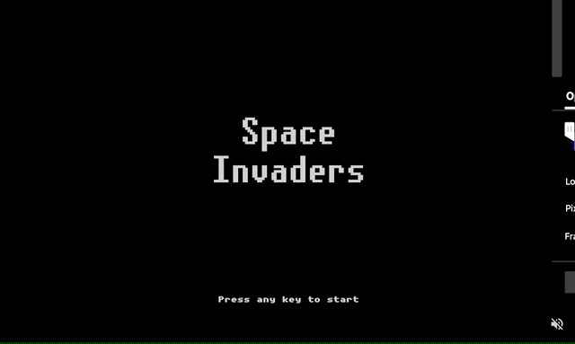

# Space Invaders
Space Invaders game in Elm

### Get started

Install dependencies with `yarn`, then start development mode with `yarn dev`.

Running `yarn build` will create production build in ./dist folder.